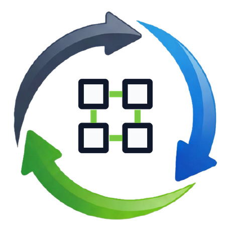

<p align="center">
  <a href="https://keiailab.com">
    
  </a>
</p>

# keiailab-commons

> **Keiailab operator foundation** — shared Go helpers for Kubernetes operator scaffolding, labels, status, security, monitoring, and Helm partials.

<p align="center">
  <b>English</b> |
  <a href="README.ko.md">한국어</a> |
  <a href="README.ja.md">日本語</a> |
  <a href="README.zh.md">中文</a>
</p>

<p align="center">
  <a href="LICENSE"></a>
  <a href="https://golang.org/"></a>
  <a href="https://pkg.go.dev/github.com/keiailab/keiailab-commons"></a>
  <a href="https://github.com/keiailab/keiailab-commons/discussions"></a>
</p>

## Design assets

| Asset | Path | Usage |
|---|---|---|
| Centered service symbol | [`docs/branding/symbol.png`](docs/branding/symbol.png) | GitHub README, Artifact Hub icon/screenshot |
| Keiailab base symbol | [`docs/branding/base-symbol.png`](docs/branding/base-symbol.png) | Source reference for the outer rotating-arrow mark |
| Branding guide | [`docs/BRANDING.md`](docs/BRANDING.md) | Public visual usage rules |

Operator authors repeatedly re-implement the same scaffolding: restricted
PodSecurity contexts, supported-version matrices, default-deny NetworkPolicies,
ServiceMonitor builders, finalizer helpers, status condition catalogs. Each
independent copy drifts apart over time and grows silent inconsistencies.
`keiailab-commons` is one place to get the canonical implementation, behind a
small API surface that follows a clear stability promise.

## Installation

```sh
go get github.com/keiailab/keiailab-commons@latest
```

Requires Go 1.26+. The library depends only on `k8s.io/api`,
`k8s.io/apimachinery`, and `sigs.k8s.io/controller-runtime`; most packages use
no controller-runtime at all (see the table below).

## Usage

Build a `restricted`-profile container SecurityContext and a supported-version
allowlist:

```go
import (
	"github.com/keiailab/keiailab-commons/pkg/security"
	"github.com/keiailab/keiailab-commons/pkg/version"
	corev1 "k8s.io/api/core/v1"
)

var supported = version.MustList("1.0", "1.1", "1.2")

func containerSecurityContext() *corev1.SecurityContext {
	return security.RestrictedContainer(
		security.WithRunAsUser(999),
		security.WithRunAsGroup(999),
	)
}

func isAllowed(v string) bool { return supported.IsSupported(v) }
```

Apply recommended Kubernetes labels and report status conditions on a CR:

```go
import (
	"github.com/keiailab/keiailab-commons/pkg/labels"
	"github.com/keiailab/keiailab-commons/pkg/status"
	metav1 "k8s.io/apimachinery/pkg/apis/meta/v1"
)

// app.kubernetes.io/* recommended labels.
ls := labels.New("my-db", "my-db-prod", "database", "1.2.0", "my-operator")
deployment.Labels = ls.All()                 // full label set
deployment.Spec.Selector.MatchLabels = ls.Selector() // stable subset (no version)

// Standard Ready/Available conditions.
status.SetReady(&cr.Status.Conditions, "Reconciled", "all components ready", cr.Generation)
if status.IsReady(cr.Status.Conditions) {
	// ...
}
```

Each package ships runnable examples in its `doc.go` — browse them with
`go doc github.com/keiailab/keiailab-commons/pkg/<name>` or on
[pkg.go.dev](https://pkg.go.dev/github.com/keiailab/keiailab-commons).

## Packages

| Package | Tier | Purpose |
|---|---|---|
| `pkg/finalizer` | Stable | Finalizer helpers — `Add` / `Remove` / `Has` / `EnsureOrder` (stdlib `slices` only, no controller-runtime). |
| `pkg/labels` | Stable | Recommended `app.kubernetes.io/*` labels — `New`, `Set.All()`, `Set.Selector()`, plus a v2 mapping (`AllV2`). |
| `pkg/status` | Stable | Standard Condition types + Reason catalog — `SetReady`, `SetAvailable`, `SetProgressing`, `SetDegraded`, `IsReady`, `FindCondition`. |
| `pkg/storageclass` | Stable | DNS-1123 storageClass validation + `Normalize` / `MustNormalize` (empty → cluster-default pointer). |
| `pkg/version` | Beta | Supported-version allowlist — `MustList`, `IsSupported`, `Strings`, `Default` + generic `Matrix[E MatrixEntry]`. |
| `pkg/monitoring` | Beta | Prometheus Operator `ServiceMonitor` / `PrometheusRule` builders (unstructured — no CRD dependency). |
| `pkg/networkpolicy` | Beta | Deny-by-default NetworkPolicy builder + functional options (`WithSelfIngress`, `WithIngressFromPeers`, `WithDenyEgress`, `WithEgressToPeers`). |
| `pkg/security` | Beta | PodSecurity `restricted` SecurityContext builder — container / pod split + seccomp profile helpers. |
| `pkg/events` | Beta | Minimal `Recorder` interface + `Emit` / `EmitWarning` / `WrappedError` (nil-safe). |
| `pkg/pvc` | Beta | PVC expansion helpers — comparison + safe in-place update (uses controller-runtime). |
| `pkg/topology` | Beta | `TopologySpreadConstraints` HA defaults + zone-aware affinity. |
| `pkg/probes` | Experimental | `corev1.Probe` fluent builder — HTTP / HTTPS / TCP / Exec with kubelet defaults. |
| `pkg/webhook` | Experimental | Admission validation helpers — `ValidateAllowedVersion`, `ValidateWithPredicate`, conversion registry. |
| `pkg/bundle` | Experimental | OLM v1 bundle metadata helpers — annotations, FBC schema types, directory validation. |

A Helm library chart (`charts/keiailab-commons`, `type: library`) provides
matching partials for downstream consumer charts.

See [docs/STABILITY.md](docs/STABILITY.md) for the tier promise,
[docs/ARCHITECTURE.md](docs/ARCHITECTURE.md) for the package surface and design
invariants, and [docs/ROADMAP.md](docs/ROADMAP.md) for tier-promotion criteria
and the v1.0 graduation checklist.

## Versioning

- **v0.x**: API breaking changes are allowed. Each `v0.N.M` tag bumps a
  package's public API or a meaningful behavioural change — pin a specific
  version in `go.mod`.
- **v1.0 onwards**: Semantic Versioning. Breaking changes require an ADR.

## Contributing

Bug reports and feature requests go to
[Issues](https://github.com/keiailab/keiailab-commons/issues). See
[CONTRIBUTING.md](CONTRIBUTING.md) for the development workflow and
[SECURITY.md](SECURITY.md) for the private disclosure process.

## License

[MIT](LICENSE) © keiailab.
